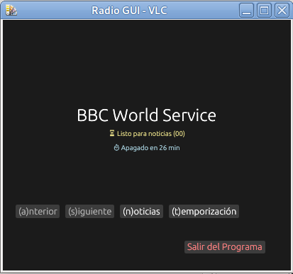

# Radio GUI - VLC Control

V1.0 - 20250216

Una aplicación de escritorio ligera escrita en *Rust* utilizando el *framework eframe*. Este programa permite sintonizar emisoras de radio por internet, gestionar una sintonización automática de noticias y programar un temporizador de apagado, todo mediante el motor de reproducción cvlc.

Este proyecto se ha generado con la ayuda del asistente de *IA* de *Google*.

## Requisitos Previos

Este programa utiliza cvlc (desde la *línea de comandos*) para el streaming de audio. Asegúrate de tenerlo instalado en tu sistema (probado en Debian 13):

Comando de instalación:
sudo apt update && sudo apt install vlc -y

## Instalación y Compilación

1. Clona este repositorio:
   git clone https://github.com/aig-microC/radio-gui-egui
   
    cd radio-gui-egui

2. Compila el proyecto con Cargo:
   cargo build - -release

3. El ejecutable se encontrará en target/release/radio-gui.

## Configuración

Para que el programa funcione correctamente, **debes situar los siguientes archivos en el mismo directorio que el ejecutable**:

- emisoras.m3u: Lista de emisoras en formato M3U. Se extrae el nombre tras #EXTINF:-1,.
- noticias.m3u: Contiene una única URL para la emisora de noticias.
- minutos_noticias.txt: Linea 1 (inicio), Linea 2 (fin).
- ultima_estacion.txt: El programa guarda aquí el índice de la ultima radio escuchada.

En el repositorio se sitúa en el subdirectorio *distribucion/bin*.

## Controles

La interfaz se puede controlar tanto con el ratón como mediante atajos de teclado:

- S o botón (s)iguiente: Pasa a la siguiente emisora de la lista (circular).
- A o botón (a)nterior: Vuelve a la emisora anterior.
- N o botón (n)oticias: Activa/Desactiva el modo noticias (se ilumina en amarillo).
- T o botón (t)emporizacion: Programa el apagado automático (90 min -> 10 min -> OFF).
- ESC o botón Salir: Cierra el programa y detiene la reproducción de VLC.

## Funciones Especiales

### Modo Noticias
Si el botón de noticias esta activo, el programa monitoriza el reloj del sistema. Al llegar al minuto de inicio configurado, cambia automáticamente a la radio de noticias. Al llegar al minuto final, regresa a la emisora previa.

### Temporizador
Permite programar el cierre total de la aplicación. Muestra una cuenta atrás en tiempo real debajo del nombre de la emisora con un tamaño de fuente reducido. Cada vez que se pulsa el botón o la tecla t (o T) la temporizador pasa por 90 min, 80 min ... 10 min. Si se pulsa otra vez el temporizador se desactiva. Si se pulsa una vez más se vuelve a repetir el ciclo.

## Licencia

Este proyecto esta bajo la Licencia [MIT](https://opensource.org/license/mit).

## ¿Dónde encontrar la dirección de internet de las emisoras?

Para modificar o crear tus ficheros *.m3u* puedes encontrar las direcciones (*URL*) de las emisoras en las siguientes páginas *web*:

* [radio-browser](https://www.radio-browser.info/) 
* [Radio stream](https://streamurl.link/)
* [fmstream.org](https://fmstream.org)
* [Internet-Radio.com](Internet-Radio.com)

Si estás en una *web* que no te da el *link* fácilmente, abre la consola de desarrollador en tu navegador *(F12)*, ve a la pestaña *Red (Network)* y filtra por *Media* o *XHR* mientras reproduces la radio. Deberías ver aparecer la *URL* del flujo de audio.

